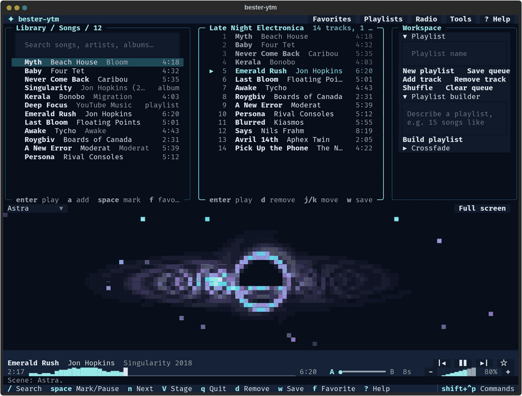

# bester-ytm

[](https://github.com/fmschulz/bester-ytm/actions/workflows/ci.yml)
[](https://github.com/fmschulz/bester-ytm/releases)
[](https://fmschulz.github.io/bester-ytm/)
[](LICENSE)
[](pyproject.toml)

A terminal YouTube Music player. Search, queue, and play through `mpv` with
DJ-style crossfades, build playlists from plain-English briefs with the AI
provider you choose, and publish them to your YouTube Music account.



- **Player**: search, album browsing, an editable queue, local playlists,
  favorites, local audio files, and web radio with live song names.
- **Stage**: a black hole, a pulsar plot after Joy Division's *Unknown
  Pleasures*, a loudness skyline, or an oscilloscope, driven by the music's
  loudness and drawn in your theme's colors.
- **DJ transitions**: the next track is prebuffered on a second `mpv` deck and
  crossfaded in. The seek bar draws each track's loudness as it plays.
- **Playlist builder**: turns seed songs or a brief ("15 songs like Blind
  Guardian, save as powermetal-15") into a reviewed plan, then creates the
  playlist in your account.
- **AI providers**: the Codex CLI, the Claude Code CLI, any OpenAI-compatible
  endpoint (OpenRouter, Ollama, vLLM), the Anthropic API, or an offline
  heuristic.
- **Local-first**: logins, plans, playlists, and settings stay under your home
  directory. Only YouTube Music and your AI provider receive requests.

Runs on Linux and macOS; on Windows, use WSL2.

## Quick start

Install `uv`, `mpv`, and `yt-dlp`:

```bash
brew install uv mpv yt-dlp                  # macOS
sudo apt-get install -y mpv yt-dlp          # Ubuntu/Debian (uv: astral.sh/uv)
sudo pacman -S --needed uv mpv yt-dlp       # Arch Linux
```

From a clone of this repository:

```bash
./install.sh    # installs the bester-ytm command (uv tool install)
bester-ytm      # starts the TUI
```

Run `./install.sh` again after `git pull` to update the installed command.

Search, playback, web radio (`radio:`), and local files (paste a path such as
`~/Music`) work without an account. Library playlists and playlist editing
need a login from a browser that is signed in at
[music.youtube.com](https://music.youtube.com):

```bash
bester-ytm auth login
```

[Getting Started](https://fmschulz.github.io/bester-ytm/getting-started/)
covers the paste and OAuth alternatives.

## Documentation

[fmschulz.github.io/bester-ytm](https://fmschulz.github.io/bester-ytm/):
[Getting Started](https://fmschulz.github.io/bester-ytm/getting-started/),
[Usage](https://fmschulz.github.io/bester-ytm/usage/),
[Playlist Builder & AI](https://fmschulz.github.io/bester-ytm/builder/),
[Configuration](https://fmschulz.github.io/bester-ytm/configuration/),
[Architecture](https://fmschulz.github.io/bester-ytm/architecture/), and
[Development](https://fmschulz.github.io/bester-ytm/development/).

## Development

```bash
uv sync
uv run pytest -q     # no network, no mpv
uv run ruff check .
uv run mypy src
```

CI checks lint, types, and 80% test coverage on Python 3.11 and 3.13. See
[CONTRIBUTING.md](CONTRIBUTING.md) for how to propose changes.

## License

MIT; see [LICENSE](LICENSE).
