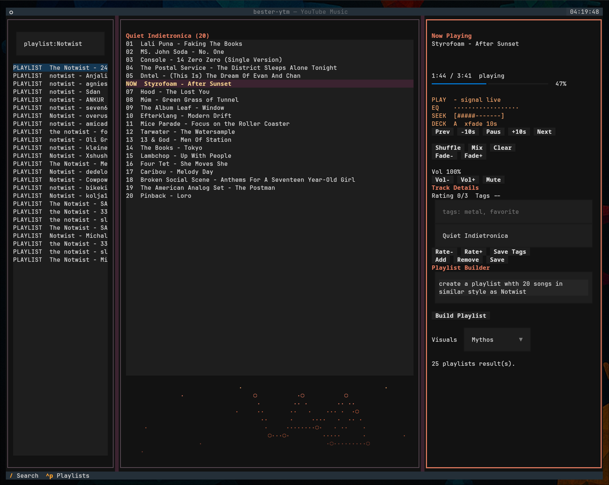

# bester-ytm

A local terminal YouTube Music companion: search, queue, and play music
through `mpv` with DJ-style dual-deck crossfades, build playlists from plain
English briefs with an AI provider of your choice, and publish them to your
YouTube Music account.

## What it does

- **Terminal player** — a Textual TUI with search, album browsing, an
  editable queue, local playlists, favorites, local audio files, web
  radio with live song names, and audio-reactive visuals.
- **DJ transitions** — the next track is prebuffered on a second silent
  `mpv` deck and blended in with an equal-power crossfade.
- **Playlist builder** — turn seed songs or a prose brief ("15 songs in the
  style of Blind Guardian, save as powermetal-15") into a reviewed plan, then
  create the real playlist in your account.
- **AI, your way** — playlist briefs and similar-track suggestions can run
  through the Codex CLI, any OpenAI-compatible endpoint (OpenRouter, Ollama,
  vLLM), the Anthropic API, or a fully offline heuristic.
- **Local-first** — credentials, plans, playlists, and settings live under
  your home directory; nothing is sent anywhere except YouTube Music and the
  AI provider you configure.

## Platform support

Linux and macOS. The player controls `mpv` over a Unix domain socket, so
Windows is not supported (WSL2 works).

## Where to start

- [Getting Started](getting-started.md) — install, first run, and logging in.
- [Usage](usage.md) — TUI keys, search syntax, and CLI commands.
- [Playlist Builder & AI](builder.md) — how plans are built and which AI
  providers are supported.
- [Configuration](configuration.md) — `config.toml` and data locations.
- [Architecture](architecture.md) — the dual-deck engine and design
  invariants.
